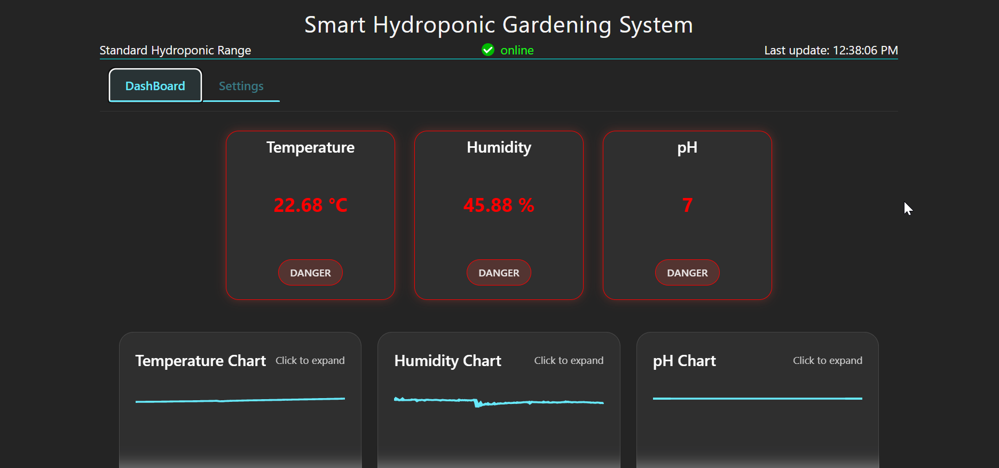
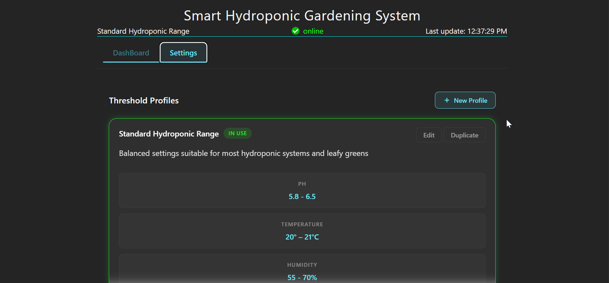

# Smart Hydroponic Garden System

## Team
- Hoa Tuong Minh Nguyen (GitHub: @MinhHoaNguyen)
- Vy Lo Phuong Tran (GitHub: @vlotran)
- Thai Nguyen (GitHub: @d2blepeace)
- [Team Member 4] (GitHub: @username)

## Project Description
The Smart Hydroponic Garden System dashboard displays sensor data collected from our Raspberry Pi monitoring system, including environmental readings and system status. The frontend connects to a FastAPI backend hosted on the Raspberry Pi server to fetch and visualize sensor readings.

## Proof of Concept Scope
**This PoC demonstrates (Frontend):**
- A React dashboard UI running locally via Vite
- Fetching and displaying sensor data from our Raspberry Pi–hosted backend API
- Basic visualization of environmental readings and system status
- Customizable threshold profiles with visual alerts when parameters fall outside desirable ranges

**Not included yet:**
- Hardware automation controls (pumps/lights/nutrient dosing)
- Advanced analytics and reporting
- Cloud hosting for the frontend (currently runs locally; users cannot access it via a public URL yet)
- Options to convert units: F -> C, C -> F on Dashboard's value of sensors.

## Prerequisites
- **Node.js 20.19+ (recommended: Node 20 LTS)**  
  Required because our tooling (Vite plugin + Tailwind) requires Node 20+.
  - Download: https://nodejs.org/
- **npm** (included with Node.js)
- Network access to the Raspberry Pi backend API

Verify installation:
```bash
node -v
npm -v
```

## Installation
### 1) Clone repository
```bash
git clone <repository-url>
cd group-project-expedition-23
```

### 2) Install frontend dependencies
```bash
cd frontend
npm install
```

## Running the PoC
```bash
npm run dev
```

You should see output similar to:
```text
> frontend@0.0.0 dev
> vite
VITE v7.3.1  ready in 500 ms
➜  Local:   http://localhost:5173/
```

Open the Local URL shown (commonly `http://localhost:5173/`) to view the dashboard.

## Demo
- **Video (Frontend UI walkthrough):** [YouTube Link](https://youtu.be/t5Pe3VHo7Zo)

  **Notes:**
  - There is an initialization period where the system may display as **“Offline”** immediately after first connecting.
  - On the main dashboard graphs, hovering over the chart shows a **tooltip** with the reading **timestamp**.
  - In **Settings**, after changing a threshold value, you must **refresh the page** for the dashboard to reflect the updated thresholds.
  - Only the **“Standard Threshold Profile”** can be applied right now. New profiles can be created, but they **cannot be activated/used yet**.
  - Only the **“Temperature”** and **“Humidity”** readings are live data,  **“pH”** is a placeholder for now.
- **Video (API call testing):** [YouTube Link](https://youtu.be/-H160rNT_Qo)

- Screenshots/GIFs:
  - Main dashboard showing sensor readings
  
  - Settings dashboard for customizing threshold profiles
  

## Technical Stack
- **Frontend/UI:** React + Vite (component-based UI, fast dev server)
- **Styling:** Tailwind CSS + custom CSS (layout + status color-coding)
- **Backend API:** FastAPI (async-native, minimal boilerplate, auto API docs)
- **Database:** SQLite + aiosqlite (zero-config, Raspberry Pi–friendly)
- **Data Validation:** Pydantic (enforces valid sensor ranges and configuration constraints)
- **Logging:** Loguru (simple, readable logging)
- **Background Tasks:** Python asyncio (non-blocking periodic sensor polling)
- **Networking:** ngrok (secure public URL for Raspberry Pi backend)
- **Hardware:** Raspberry Pi 5 (backend hosting + GPIO for sensors)
- **Sensors:** BME280, BME680 (temperature/humidity/pressure/air quality via I2C)
- **Drivers/Libraries:** Adafruit CircuitPython (tested sensor libraries)

## What's Next (195B)
- Improve dashboard UX (filters, time ranges, better charts)
- Live updates (WebSockets/SSE) for real-time sensor streaming
- Alert management UI (acknowledge/resolve/history)
- Automation controls and scheduling for hydroponic hardware
